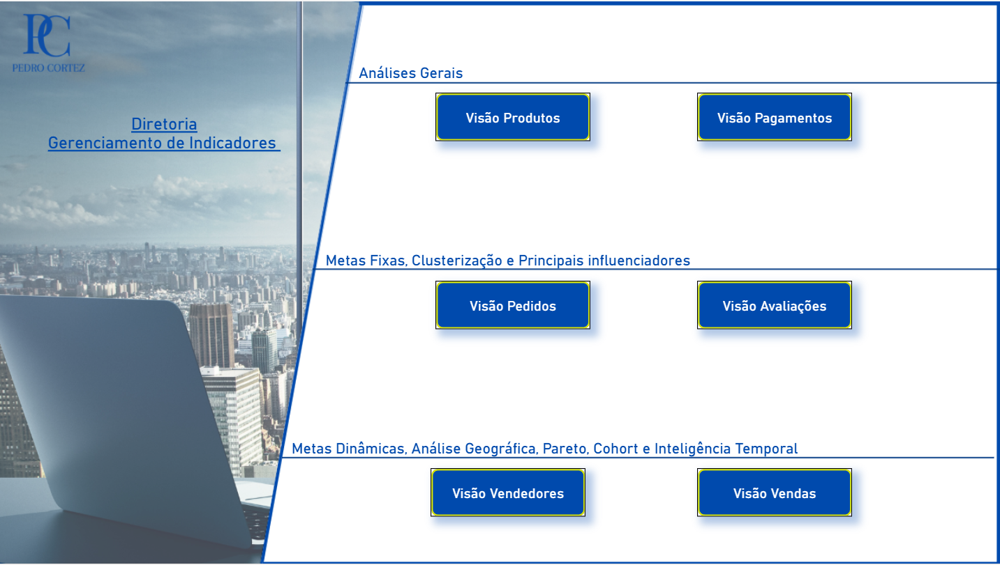

# 📊 Relatório de Indicadores — Projeto de Business Intelligence

Este projeto apresenta um **relatório completo em Power BI** desenvolvido para atender às solicitações da diretoria, com **visões analíticas por Produtos, Pagamentos, Pedidos, Avaliações, Vendedores e Vendas**.

O relatório foi estruturado com **visuais interativos, indicadores de desempenho (KPIs)** e **gráficos dinâmicos** para apoiar a tomada de decisão com base em dados.

---

## 🚀 Acesso ao Dashboard

👉 [**Acesse o Dashboard Publicado no Power BI**](https://app.powerbi.com/view?r=eyJrIjoiNTE3MGE0NDgtMTYwMC00ODhjLTk0ZDYtNTY0ZTBlNjkxM2U5IiwidCI6IjhkOGE1MTdmLWUyZDEtNGFmMy05ZmM3LTc1OThmMWI2ZmQ4MyJ9&embedImagePlaceholder=true)

📸 **Print do Dashboard Principal:**

---

## 🧭 Estrutura do Relatório

### 🔹 Visão Produtos

**Indicadores:**
1. Quantidade de Produtos Cadastrados  
2. Quantidade Total de Categorias  
3. Quantidade Total de Fotos  
4. Quantidade de Produtos por Categoria  
5. Quantidade de Fotos por Categoria  

**Solicitações adicionais do CEO:**
1. Quantidade de categorias únicas por altura  
2. Quantos produtos possuem mais de 15 fotos  
3. Quantidade de fotos por produto  
4. Quantidade de categorias únicas por comprimento  
5. 2 insights próprios sobre os dados de produtos  

---

### 🔹 Visão Pagamentos

**Indicadores:**
1. Quantidade de pedidos  
2. Valor total de pagamentos  
3. Quantidade de pagamentos  
4. Pagamentos por tipo e status  

**Análises gráficas:**
- Valor total de pagamentos por status  
- Quantidade de pagamentos por tipo  
- Hierarquia de valor médio por status e tipo  
- Detalhes por pedido e tipo de pagamento  
- Gráfico de rosca com clientes únicos por status  
- +2 gráficos adicionais com insights próprios  

---

### 🔹 Visão Pedidos

**Indicadores:**
1. Quantidade de pedidos e clientes  
2. Pedidos por ano (2016–2018)  
3. Taxa de crescimento anual  
4. KPI com meta diária de 40%  

**Análises:**
- Quantidade x Meta (Anual e Mensal)  
- Pedidos por Estado e Cidade  
- Matriz comparando pedidos Ano Atual x Anterior  
- Gráfico de área por estado e cidade  
- +3 gráficos com insights sobre status dos pedidos  

---

### 🔹 Visão Avaliações

**Indicadores:**
1. Avaliações únicas totais e por score  
2. Tempo médio de resposta (dias e horas)  
3. Avaliações score 4–5 (SP e RJ – 2017/2018)  
4. Taxa de crescimento 2017 → 2018  

**Análises:**
- Dispersão por estado e tempo médio  
- Pizza por classificação  
- Principais influenciadores por estado  
- Agrupamento em 6 clusters  
- Relação entre score, tempo e volume de avaliações  

---

### 🔹 Visão Vendedores

**Indicadores:**
1. Total de vendedores e vendas  
2. Vendas de itens > R$500.000  
3. Vendedores dentro ou acima da meta  

**Análises:**
- Funil com Top 10 estados que mais vendem  
- Mapa geográfico (País, Estado, Cidade)  
- Acompanhamento dinâmico de metas  
- Tabela detalhada com percentuais e metas por vendedor  

---

### 🔹 Visão Vendas

**Indicadores:**
1. Total de Vendas  
2. Total Acumulado YTD (Ano Atual e Anterior)  
3. Taxa de Crescimento Acumulada  
4. % de Desconto de Frete (regra de R$10.000+)  

**Análises:**
- Análise de Pareto 80–20  
- Total de vendas acumuladas mês a mês  
- Análise de retenção de vendedores (COHORT)  
- Comparativo Ano Atual x Anterior com taxa de crescimento  

---

## 🛠️ Tecnologias Utilizadas

- **Power BI Desktop & Power BI Service**
- **Microsoft 365 (Integração corporativa com domínio)**
- **GitHub para versionamento**
- **Excel / CSV** como fonte de dados
- **SQL e DAX** para cálculos e modelagem de dados  

---

## 🧩 Autor

👤 **Pedro Cortez**  
📧 contato@pcdatasolution.com.br  
💼 [LinkedIn](https://www.linkedin.com/in/pedro-cortez96/)  
🌐 [Portfolio](portfolio.pcdatasolution.com.br)

---

> 📈 *Este relatório foi desenvolvido com foco em fornecer à diretoria uma visão estratégica e integrada dos principais indicadores de desempenho, fortalecendo a cultura data-driven dentro da empresa.*

